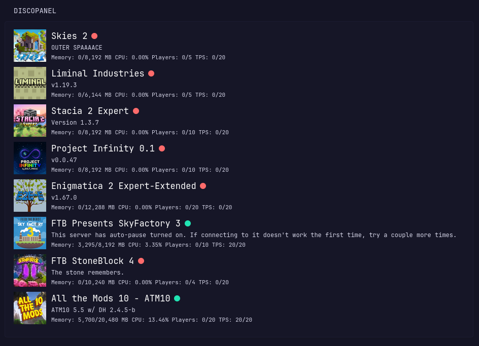

# Discopanel Widget
Lists all servers in your Discopanel host. Server icon functionality requires using a url for the picture. These can be obtained from the curseforge or modrinth page directly. I imagine that using direct file paths would also work, you just might have to adjust how the picture file path is read in glance. I have not tested this functionality so there may be some amount of testing you would need to do. 

Discopanel v2.0.0 is here! This means that you will have to create a api token from the user page to use this functionality. The only permissions this app needs are `Read: Servers` and `Read: Server Config`. You can limit this to specific servers so you only get to see a certain selection of the servers on your Discopanel host or just add all of them! As of v2.0.1, you cannot determine the permissions of an API Token on a token by token basis, so I created a new user with only the permissions I described using the Roles Settings menu in Discopanel. Then, I made a new user with only that role and made an API Token from there. Once you have that token you can just past it into the environment variable and you are done!

# Environment Variables
`DISCOPANEL_HOST` = URL/IP of Discopanel host. Requires http/https prefix. 
`DISCOPANEL_TOKEN` = API Token used to authenticate with the Discopanel Server

# Preview


# YAML
```yaml
- type: custom-api
  title: Discopanel
  cache: 30s
  template: |
    {{ $serverList := newRequest "${DISCOPANEL_HOST}/discopanel.v1.ServerService/ListServers"
      | withHeader "Content-Type" "application/json"
      | withHeader "Authorization" "Bearer ${DISCOPANEL_TOKEN}"
      | withStringBody `{"fullStats": true}`
      | getResponse
    }}

    {{ range $serverList.JSON.Array "servers" }}
      {{ $mem_usage := .Int "memoryUsage" }}
      {{ $mem_total := .Int "memory" }}
      {{ $cpu := .Float "cpuPercent" }}
      {{ $players := .Int "playersOnline" }}
      {{ $max_players := .Int "maxPlayers" }}
      {{ $tps := .Float "tps" }}
      {{ $id := .String "id" }}
      {{ $status := .String "status" }}

      {{ $serverConfig := newRequest "${DISCOPANEL_HOST}/discopanel.v1.ConfigService/GetServerConfig"
        | withHeader "Content-Type" "application/json"
        | withHeader "Authorization" "Bearer ${DISCOPANEL_TOKEN}"
        | withStringBody (printf `{"serverId": %q}` $id)
        | getResponse
      }}
      {{ $icon := $serverConfig.JSON.String "categories.1.properties.6.value" }}

      <div style="margin-bottom: 1rem;">
        <div style="display: flex; align-items: center; gap: 1rem;">
          <a href="${DISCOPANEL_HOST}/servers/{{ $id }}"></a>
          <div style="flex-grow:1; min-width:0;">
            <span><a href="${DISCOPANEL_HOST}/servers/{{ $id }}" class="color-highlight size-h1">{{ .String "name" }}</a></span>
            {{ if eq "SERVER_STATUS_RUNNING" $status }}
              <span style="display: inline-block; background-color: var(--color-positive); width: 12px; height: 12px; border-radius: 50%;"></span>
            {{ else if eq "SERVER_STATUS_STARTING" $status }}
              <span style="display: inline-block; background-color: var(--color-separator); width: 12px; height: 12px; border-radius: 50%;"></span>
            {{ else }}
              <span style="display: inline-block; background-color: var(--color-negative); width: 12px; height: 12px; border-radius: 50%;"></span>
            {{ end }}
            <p class="size-h5">{{ .String "description" }}</p>
            <div class="size-h6">
              <span>Memory: {{ formatNumber $mem_usage }}/{{ formatNumber $mem_total }} MB</span>
              <span>CPU: {{ printf "%.2f" $cpu }}%</span>
              <span>Players: {{ $players }}/{{ $max_players }}</span>
              <span>TPS: {{ $tps }}/20</span>
            </div>
          </div>
        </div>
      </div>
    {{ end }}

```
